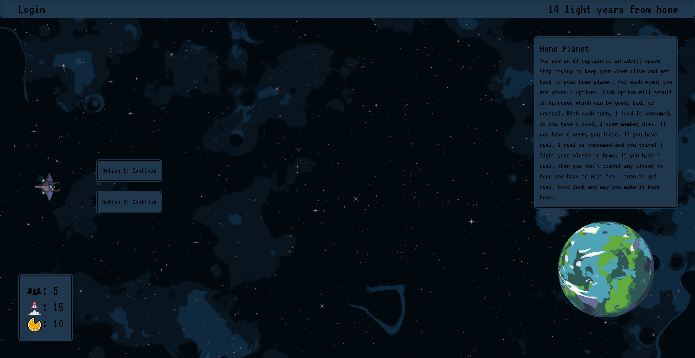
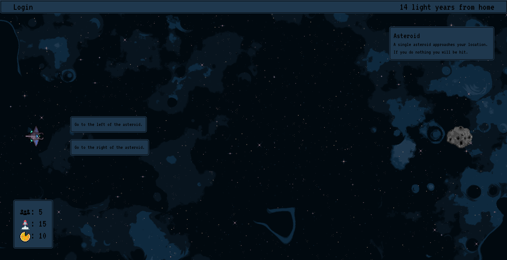

# Adrift in Space

## Table of Contents

<!-- TOC -->

- [Adrift in Space](#adrift-in-space)
  - [Table of Contents](#table-of-contents)
  - [Description](#description)
  - [License](#license)
  - [Installation](#installation)
  - [supplies](#supplies)
  - [How 3 supplies interact](#how-3-supplies-interact)
  - [How you loose](#how-you-loose)
  - [How you win](#how-you-win)
  - [Screenshots](#screenshots)
  - [Future Features](#future-features)
  - [Resources](#resources)
  - [How to create a new event](#how-to-create-a-new-event)
  - [Credits](#credits)

<!-- /TOC -->

## Description
A space themed Sort the Court. You are an AI captain of an adrift space ship trying to survive and get back to your home planet.

You can check out the game at this [link](https://ryansheehy0-adrift-in-space-de8f1563a0e1.herokuapp.com/).

## License

## Installation

First, clone the repo at `https://github.com/ryansheehy0/Adrift_In_Space`.

Second, run `npm install` in the Develop folder.

Third, run `node server.js` in the Develop folder to launch the game.

Forth, go to `localhost:3000` to play.

## 3 supplies
- Crew
- Fuel
- Food

There is no need for water because all of the water gets recycled on the space ship.

## How 3 supplies interact
- Food goes down over time.
- Crew stays the same if you have Food.
- If no Food then Crew goes down over time.
- Fuel goes down over time and gets you closer to home.
- If Fuel is 0 you don't get closer to home. Stay in the same spot.

## How you loose
When you have 0 Crew.

## How you win
You get back to your home planet.

## Screenshots

## Future Features
- More events
- Storing the chosen options for each event so they will affect future events.
- Animated events
- Sound effects for each click an event
- More detailed story telling
- Jump you back to your original location when you log back in
- Multiple endings
- How 3 supplies interact with each other:
  - ^ in Crew = decrease in Food
  - ^ in Fuel = decrease in Crew(because it takes up space)
  - ^ in Food = decrease in Fuel
- Random outcomes to options
- Events happen in random order instead of one after another

## Resources
- [Background](https://deep-fold.itch.io/space-background-generator)
- Supplies
  - [Crew](https://www.flaticon.com/free-icon/team_6515003)
  - [Fuel](https://www.flaticon.com/free-icon/start-up_6514940)
  - [Food](https://www.flaticon.com/free-icon/pizza_12065322)
  - [Warning](https://www.flaticon.com/free-icon/caution_6514911)
- [Font](https://fonts.google.com/specimen/VT323)
- Events
  - [Pixel Art Maker](https://pixelartmaker.com/gallery)
    - [Asteroid](http://pixelartmaker.com/art/b02b88d8461a4fb)
    - [Purple Asteroid](http://pixelartmaker.com/art/634cc56c55a8cf2)
  - [Planets and other stuff](https://helianthus-games.itch.io/)
  - [Space Ships](https://foozlecc.itch.io/)
  - [Planet Generator](https://deep-fold.itch.io/pixel-planet-generator)
  - [Crystal Asteroid](https://www.pinclipart.com/maxpin/mihxbJ/)
  - [Space Station](https://cdna.artstation.com/p/assets/images/images/013/100/220/large/filipe-dilly-lowres-iss.jpg?1538049744)
  - [Astronaut](https://www.freepik.com/free-vector/astronaut_2921422.htm#query=planet%20pixel%20png&position=23&from_view=search&track=ais")

## How to create a new event
Find the asset first then create event based upon the asset.
1. Make sure you have your own branch!!!
  - run `git checkout -b your_first_name`
  - run `git branch` to double check you are in your branch
1. Find pixel asset
1. Copy pixel asset into public/assets/events/
1. New handlebars event file in views/
  - Add img with custom tailwind to change size and position
  - Add script with all attributes.
    - id, data-eventname, and src
1. Create backend js file
  - eventname.js in controllers/events/

- Don't do yet.
1. Create new route in routes.js
1. Add event in the order in routes.js

## Credits

- [Ryan Sheehy](https://github.com/ryansheehy0)
- [Walter Craigie](https://github.com/w4lt0r)
- [Aminah Cherry](https://github.com/Alcherry527)
- [Bonne Bautista](https://github.com/btbautista31)